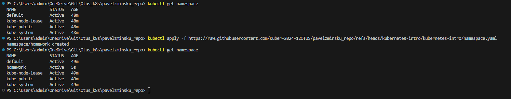
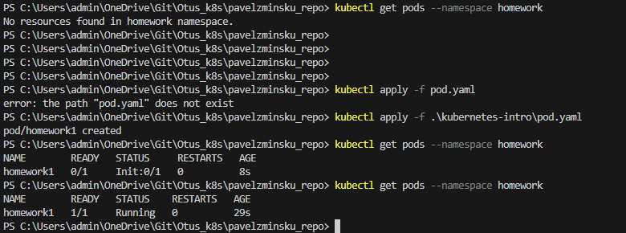
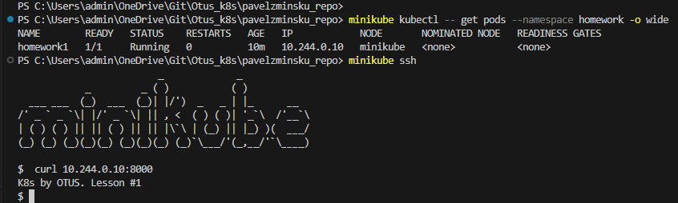

# Выполнено ДЗ № 1

 - [x] Основное ДЗ
 - [ ] Задание со *

## В процессе сделано:
 - Установлен minikube
 - Установлен kubectl
 - Создан манифест namespace.yaml
 - Создан манифест pod.yaml 
 - Запущены манифесты в minikube, создан namespace homework и pod homework1 
 - Выполнена проверка работоспособности 

## Как запустить проект:
Выполнить команду kubectl apply -f "ссылка на манифест"

kubectl apply -f .\kubernetes-intro\namespace.yaml
kubectl apply -f .\kubernetes-intro\pod.yaml

## Как проверить работоспособность:
Результаты запуска манифестов:

Итоговую работоспособность я проверял работоспособность при помощи утилиты curl из консоли minikube

## PR checklist:
 - [ ] Выставлен label с темой домашнего задания
